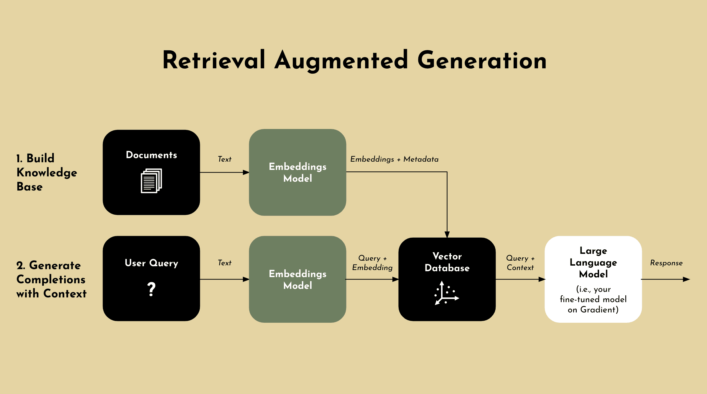

# Red Hat Developers Hands-On Day 2023, Darmstadt

## Event

Room: Helium, Darmstadtium
Time: November 29th, 2023 15:30 - 18:00 CET

Instructors:

- **Rodeina** Mohamed <rmohamed@redhat.com>
- **Steffen** Röcker <sroecker@redhat.com>

## Introduction

Welcome to our **hands-on LLM application development workshop**! Today you'll learn how to develop a simple chatbot (or "GPT") that can answer based on your own documents and how to deploy it with Podman and on OpenShift.

## Software Stack

We will use a bunch of cool open source software to build our bot:

- [Ollama](https://ollama.ai)
- [Llama.cpp](https://github.com/ggerganov/llama.cpp)
- [LlamaIndex](https://www.llamaindex.ai/)
- [Streamlit](https://streamlit.io/)

For local experimentation you should have a Python 3.11 virtual env set up already. We will also hand out access to an OpenShift cluster with GPUs and [Red Hat OpenShift Data Science (RHODS)](https://developers.redhat.com/products/red-hat-openshift-data-science/overview) where you can use a Jupyter notebook and deploy your streamlit app or connect to a hosted Ollama service.

## Basic Concepts

By now you should be familiar with commercial offerings like ChatGPT, Bing, Bard or Claude. If not, don't worry ;)

We're not going to cover GPT architecture today, remember it's going to be hands-on. If you're interested in theory we've got you covered in the [Further Readings](#-further-readings) section below. 

Instead let's have a look at our Linuxbot example streamlit app and go through its functionality step by step:

- Streamlit and how to easily build interactive apps
- Connecting to Ollama
- What is Ollama and llama.cpp?
- Models - Strange creatures and where to find them
- Quantization? How to be GPU poor and local Llama rich
- Prompting: System prompt vs user prompt
- Tokenization, see [OpenAI tokenizer](https://platform.openai.com/tokenizer)

The basic architecture of our RAG bot will look like this:

See [LlamaIndex High-level Concepts](https://gpt-index.readthedocs.io/en/stable/getting_started/concepts.html) for what's needed to query our documents:

- Embeddings & Vector Store: see this nice interactive Solara demo of [embeddings with retrieval](https://huggingface.co/spaces/alonsosilva/embeddings)
- Context
- Retrieval augmented generation (RAG)

Coincidentally few days ago LlamaIndex released RAGs, exactly what we are going to build today:
[Introducing RAGs: Your Personalized ChatGPT Experience Over Your Data](https://blog.llamaindex.ai/introducing-rags-your-personalized-chatgpt-experience-over-your-data-2b9d140769b1)

Since it was released shortly after this example app you should have a look what can improved here. One thing not implemented yet in RAGs are local models. 🦙

A very good introduction to RAG can be found in [RAG 101 for Enterprise](https://gradient.ai/blog/rag-101-for-enterprise).

## It's time to build

Now that we covered the very basics it's time for learning by doing!
First we should **modify our example bot and give it some custom data, a different prompt or try out different models**. Some of them can have quite the personality.

Have a look at the included [notebooks](../notebooks/) to see examples for text summary and natural SQL query.

### Some ideas for experimentation & improvement

We've collected a few ideas and tried to cluster them according to their required skill level:

**Beginners**:

- **Create your own bot**, some inspiration for GPTs:
	- [Awesome OpenAI GPTs 🧙‍♂️](https://github.com/promptslab/Awesome-Openai-GPTs)
	- [Open GPT](https://open-gpt.app/) 
	- [ChatGPT System Prompts](https://github.com/mustvlad/ChatGPT-System-Prompts)
- Build a **simple prompt injection game** where the user must guess a secret the GPT tries to hide
- Don't generate embeddings in the streamlit app (bad practice) and **utilize a real vector database** like Chroma, Weaviate, Qdrant, Milvus, Pinecone. Even SQLite or Postgres can be used as vector DB.

**Intermediate:**

- Make complex texts and concepts, e.g legislature, accessible for everyone. See [this](https://twitter.com/simonw/status/1728941844585955462) example.
- Replace Ollama with a [LiteLLM](https://github.com/BerriAI/litellm) proxy
- Port the streamlit app to [Solara](https://github.com/widgetti/solara)

**Expert:**

- Create a **multimodal bot that can understand images ([LLaVA](https://llava-vl.github.io/) or [BakLLaVA](https://github.com/SkunkworksAI/BakLLaVA)) and speech** ([Whisper](https://github.com/ggerganov/whisper.cpp))
- Create a loader for [Kiwix ZIM files](https://wiki.kiwix.org/wiki/Content_in_all_languages) (e.g Wikipedia)
- Add [Ollama embedding REST API](https://github.com/jmorganca/ollama/blob/main/docs/api.md#generate-embeddings) support to LlamaIndex

It's best if you find some other people interested in the same idea and change the table setup accordingly. The instructors will go from team to team. First to setup the infrastructure and then to help you implement your bot. Don't forget to ask your favorite (local) LlaMA.

## Further Readings

### General Introductions

- [Andrej Karpathy - The busy person's intro to LLMs](https://www.youtube.com/watch?v=zjkBMFhNj_g) ([slides](https://drive.google.com/file/d/1pxx_ZI7O-Nwl7ZLNk5hI3WzAsTLwvNU7/view?pli=1))
- [Matthias Plappert - Understanding LLMs An Introduction to Modern Language Modeling](https://matthiasplappert.com/talks/2023-10-17-understanding-llms.pdf)
- [The Illustrated Transfomer](https://jalammar.github.io/illustrated-transformer/)
- [Jeremy Howard - A Hacker's Guide to Language Models](https://github.com/fastai/lm-hackers)

### Tokenization

- [Deep Dive on Tokenization](https://github.com/SumanthRH/tokenization/)

### Embeddings & Vector Databases

- [Cohere - Word and Sentence Embeddings](https://txt.cohere.com/sentence-word-embeddings/)
- [Weaviate - A Gentle Introduction to Vector Databases](https://weaviate.io/blog/what-is-a-vector-database)
- [Weaviate - Vector Embeddings Explained](https://weaviate.io/blog/vector-embeddings-explained)

### RAG

- [RAG 101 for Enterprise](https://gradient.ai/blog/rag-101-for-enterprise)
- [Prompt Engineering Techniques - RAG (with history)](https://www.promptingguide.ai/techniques/rag)
- [WandB - A Gentle Introduction to Retrieval Augmented Generation (RAG)](https://wandb.ai/cosmo3769/RAG/reports/A-Gentle-Introduction-to-Retrieval-Augmented-Generation-RAG---Vmlldzo1MjM4Mjk1)
- [Arize - Introduction to retrieval augmented generation](https://arize.com/blog-course/introduction-to-retrieval-augmented-generation/)

Treasure troves:

- [r/LocalLlaMA](https://reddit.com/r/localllama)
- [Simon Willison's Weblog
](https://simonwillison.net/)
- Hamel's [blog](https://hamel.dev/) and [notes](https://hamel.dev/notes/)
- [LLM in Production Conference](https://www.youtube.com/playlist?list=PL3vkEKxWd-us5YvvuvYkjP_QGlgUq3tpA)
- [LLM Survey - A comprehensive collection of papers and resources related to Large Language Models](https://github.com/RUCAIBox/LLMSurvey)
